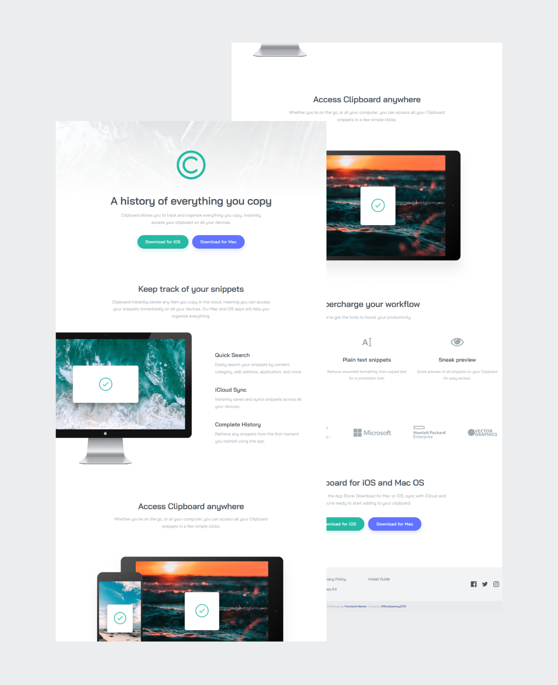

# Frontend Mentor - Clipboard landing page solution

This is a solution to the [Clipboard landing page challenge on Frontend Mentor](https://www.frontendmentor.io/challenges/clipboard-landing-page-5cc9bccd6c4c91111378ecb9). Frontend Mentor challenges help you improve your coding skills by building realistic projects. 

## Table of contents

- [Overview](#overview)
  - [The challenge](#the-challenge)
  - [Screenshot](#screenshot)
  - [Links](#links)
- [My process](#my-process)
  - [Built with](#built-with)
  - [What I learned](#what-i-learned)
  - [Continued development](#continued-development)
  - [Useful resources](#useful-resources)
- [Author](#author)
- [Acknowledgments](#acknowledgments)

## Overview

This project recreates the Clipboard landing page design using semantic HTML and SCSS. The goal was to match the provided desktop and mobile designs as closely as possible while keeping the code clean, responsive, and accessible.

### The challenge

Users should be able to:

- View the optimal layout for the site depending on their device's screen size
- See hover states for all interactive elements on the page

### Screenshot

#### Desktop-preview
<p align="center">
  
</p>

[View full desktop page screenshot](./images/desktop-preview.png)
[View full mobile page screenshot](./images/mobile-preview.png)

### Links

- Solution URL: [Solution URL](https://github.com/Officialsammy2701/clipboard-landing-page-master)
- Live Site URL: [Live Site URL](https://officialsammy2701.github.io/clipboard-landing-page-master/)

## My process

### Built with

- Semantic HTML5 markup
- SCSS
- CSS Grid
- Flexbox
- Mobile-first workflow
- Accessible focus states

### What I learned

- Building pixel-accurate layouts from design specifications
- Fine-tuning spacing and typography for visual precision
- Managing responsive behavior across breakpoints
- Structuring SCSS for maintainability and reuse
- Applying accessibility best practices (semantics and focus states)

Example: responsive image scaling beyond container

```scss
@include respond-to-mobile {
  .access__image {
    width: 95vw;
    max-width: none;
    margin-left: calc(50% - 47.5vw);
  }
}
```

### Continued development

In future projects, I want to focus on:

- Improving pixel-perfect accuracy, especially spacing, typography, and scaling across breakpoints
- Strengthening my use of responsive design techniques, particularly fluid layouts instead of fixed widths
- Writing more scalable SCSS architecture, possibly moving toward a more structured system like ITCSS or utility-based styling
- Enhancing accessibility (a11y) further, including keyboard navigation and ARIA roles in more complex components

I also want to start incorporating performance optimization, such as minimizing CSS and improving asset loading.

### Useful resources

- [MDN Web Docs](https://developer.mozilla.org/) - My go-to resource for CSS layout, accessibility, and semantic HTML.
- [Sass Documentation](https://sass-lang.com/documentation/) - Extremely helpful for understanding how "@use" works and how to properly structure SCSS modules.

## Author

- Website - [Ismail Akande](https://github.com/Officialsammy2701)
- Frontend Mentor - [@Officialsammy2701](https://www.frontendmentor.io/profile/Officialsammy2701)
- Twitter - [@sammy_2701](https://x.com/sammy_2701)


## Acknowledgments

This project was built as part of my frontend development practice.
Special thanks to Frontend Mentor for providing high-quality, real-world challenges.
